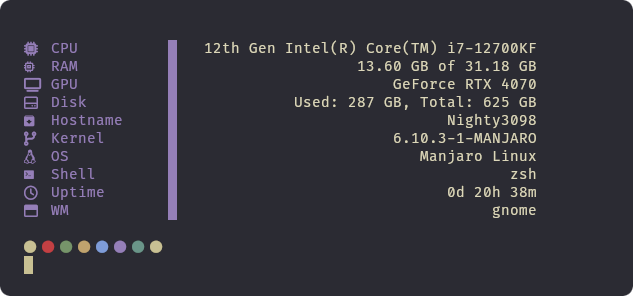

# cFetch

### A simple fetch tool for Linux written in C

<a href="https://discord.com/channels/1238858182403559505"></a>

### Installing
```bash
git clone https://github.com/DXS-GROUP/cFetch
cd cFetch
cd src
make
./cfetch
```

### Images



